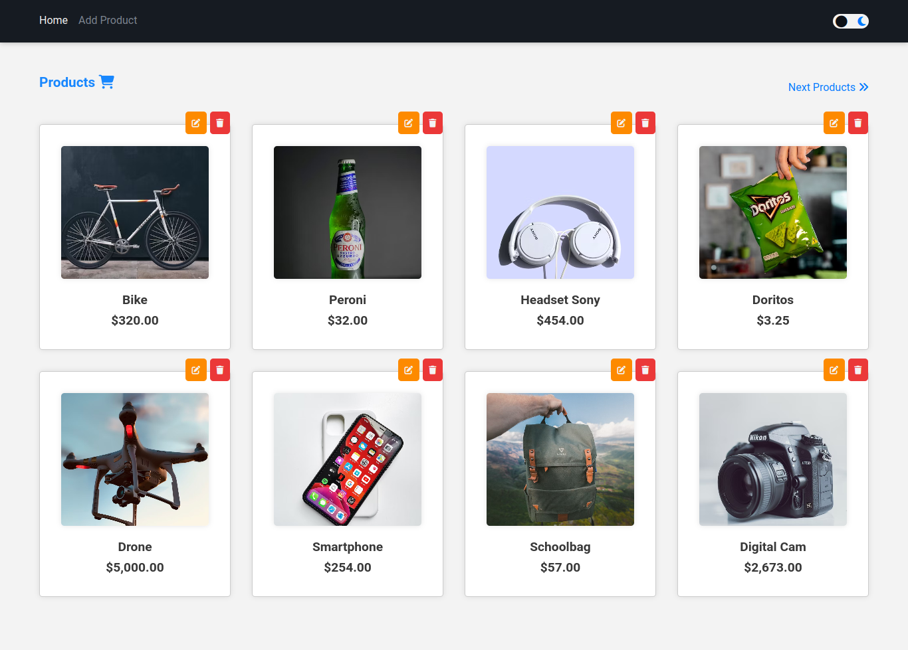
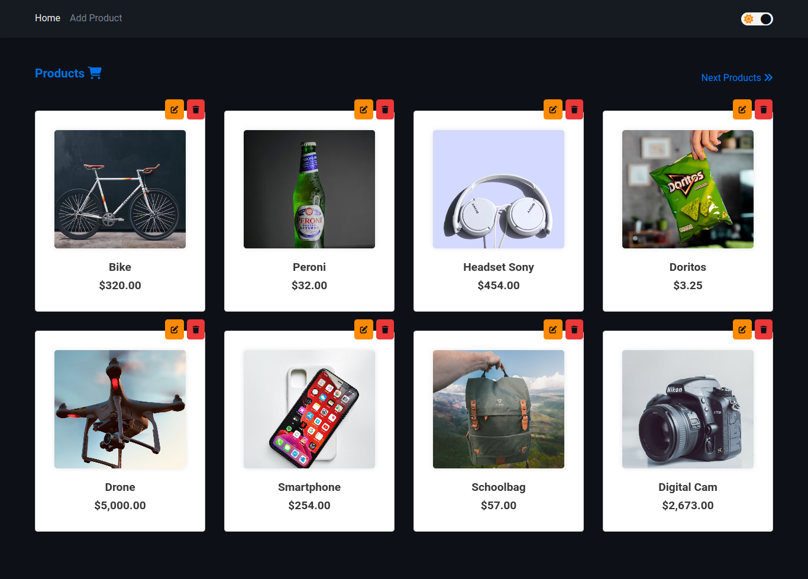

<h1 align="center">
  <br>
  
  <br>
  JSON File CRUD 
  <br>
</h1>

<h4 align="center">Aplicação MVC desenvolvida com NodeJS, ExpressJS, EJS e entre outras tecnologias.</h4>

<p align="center">
  
  
  
</p>

<p align="center">
  <a href="#features">Features</a> •
  <a href="#how-to-use">How to use ?</a> •
  <a href="#license">License</a> •
  <a href="#author">Author</a>
</p>




Website: [JsonFileCRUD](https://jsonfilecrud.onrender.com/)

### Features

A aplicação explora diversos recursos, como rotas, leituras e escrita de arquivos, uma simples paginação e muito mais..

* NodeJS
  - ExpressJS
  - EJS
  - FS (File System)
  - Mocha 
  - Chai
  - Sinon
* CSS
  - Light/Dark Theme
* Javascript
  - Switch Theme

### How To Use

```bash
# Clone repository
$ git clone https://github.com/EricNeves/jsonFileCRUD.git

# Install dependencies
$ cd jsonFileCRUD && pnpm install 

# Start 
$ pnpm start

# Start as dev
$ pnpm run dev

# Unit tests
$ pnpm test

```
> **Note**:
> Você precisará ter o gerenciador de pacotes `pnpm` para executar a aplicação, você poderá instalá-lo a partir do comando `npm i -g pnpm`.


### License


---

### Author
> Author: [@ericneves](https://www.instagram.com/ericneves_dev/) 
